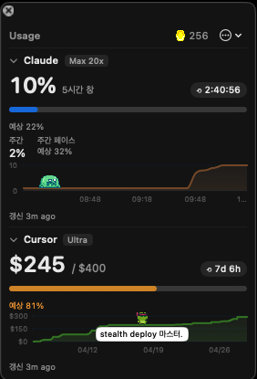

# AI Usage

Claude.ai(Max/Pro), Cursor(Ultra/Pro), Codex(ChatGPT Plus/Pro) 구독 사용량을 **항상 떠있는 작은 플로팅 윈도우**로 보여주는 macOS 앱.

<p align="center">
  
</p>

남은 한도, 다음 리셋까지의 카운트다운, 현재 페이스 예측을 한눈에. 사용한 만큼 펫 가챠 코인이 적립되고 차트 위를 195종 펫이 걷습니다.

## 기능

**사용량 대시보드**
- Claude: 5시간창 %, 주간 %, 리셋 카운트다운, 자체 스파크라인
- Cursor: 월 누적 $ (Ultra) / 요청수 (Pro), 리셋 카운트다운, 이번 달 이벤트 기반 누적 그래프
- Codex: 5시간창 / 주간 / 월간 사용률 — `codex login` 되어 있으면 자동 연동 (한 번이라도 수집 성공 시 섹션 표시)
- 플랜 자동 감지(예: `Max 20x`, `Ultra`, `Pro`)하여 헤더 배지 표시
- 사용 페이스 예측: 현재 속도로 가면 리셋 전 몇 %에 도달할지 / 한도까지 남은 시간
- 임계치 알림: 80% / 95% 도달 시 macOS 알림 (주기당 1회)
- 메뉴바 위젯: 사용률 % + 미니 차트 + 걷는 펫 (Claude/Cursor/Codex 중 소스 선택)
- 터미널 대시보드(TUI): `--tui` 플래그로 htop 스타일 실행
- 메인 패널 버전 칩: 새 버전이 나오면 주황색으로 강조, 클릭 시 업데이트 확인

**펫 & 가챠**
- **195종 픽셀 펫**, 5단계 등급(Common/Rare/Epic/Legendary/**Mythic**). 사용량이 코인으로 자동 적립되어 가챠(1회 300코인, 10연차 보너스 1회 무료)를 돌릴 수 있음. 포켓몬 스타일 알 부화 연출 + 도감(이름 검색·보유/미보유 필터). 펫마다 전용 대사·설명(개발자/CS/AI 밈 톤).
- **코인 수급처**: 실제 AI 사용량 외에도 **사용 스트릭**(사용한 날 연속 카운트, 마일스톤 보너스)과 **오늘의 AI 뉴스 퀴즈**(최신 AI 뉴스 3지선다, 정답 수에 따라 코인) 등 반복 수급 경로 제공.
- **이로치(색상 변종)**: 가챠 중복 또는 사용 시간으로 3티어 해금. 만렙 이후 초과분은 **이로치 조각**으로 환원되고, 조각 33개로 최상위 **레인보우 레어**(무지개 순환색) 해금에 도전 (성공률 15%, 10회 천장 확정).
- **Mythic 펫 전용 기능**: 1.5배 크기, 시그니처 오라, 특수 모션, 호버 도발, 사용량 한계 도달 시 특수 반응. Mythic은 일반 가챠에서 나오지 않고 프리미엄 가챠권(**sudo pull**)으로만 획득.
- **파티 프리셋**: 펫 3마리로 파티를 짜서 차트 소스별(Claude/Cursor/Codex)로 할당. 프리셋 슬롯 기본 3개 + 코인으로 증설.
- **코스메틱 이펙트**: 오라/트레일/파티클 등 10종을 RP로 구매해 펫에 장착.
- **도장(Gym)**: 5개 지역 × 11개 카테고리 × 4티어 = 44개 뱃지. 티어 클리어·챔피언·지역 마스터 보상.
- **트레이너 카드 / 레포트**: 내 수집 현황을 카드로 요약, GIF 내보내기 지원.
- 펫 휴식 권유: 장시간 연속 사용 시 펫이 휴식 권유 말풍선. 빨리 반응할수록 최대 500코인 보상.

**커뮤니티 (선택 기능 — 닉네임 등록 시)**
- **글로벌 랭킹**: 월간 리더보드(VP 기준) + 직전 달 Top3 시상대/명예의 전당. 월간·주간 순위에 따라 참여자 전원 **RP** 보상.
- **길드**: 길드를 창설하거나 초대 코드로 가입해, 멤버 상위 5명의 VP 합산으로 길드 랭킹을 겨룸. 길드 사무실 씬 꾸미기, 길드장 초대장/추방/해체 관리.
- **1:1 쪽지 (E2EE)**: 트레이너 간 종단간 암호화(HPKE) 쪽지. 서버는 암호문만 보관하고 개인키는 각자 기기 Keychain에만 저장. 랭킹 리스트에서 바로 발송.
- **게시판**: 짧은 글 + 좋아요 + 댓글/댓글 좋아요.
- **오늘의 개발 운세**: GitHub 계정 생성일 기반 사주 풀이 (GitHub 연동 필요).
- **오늘의 AI 뉴스 퀴즈**: 매일 갱신되는 AI 뉴스 브리핑 + 3지선다, 정답 수에 따라 코인 보상.
- **기여자 보상**: 이 레포에 PR이 머지되면 1건당 500 RP.

**기타**
- 패치 공지: 업데이트 후 첫 실행 시 새 버전 변경사항 창 표시, 확성기 버튼으로 다시 보기
- 인앱 사용 가이드: 책 아이콘 → 기능별 설명 13개 섹션
- 날씨 이펙트(옵트인): 실제 날씨에 맞춰 패널에 비/눈/뇌우 파티클
- 설정 패널: 창 투명도, 알림/페이스 표시 토글, 펫/테마 선택 등
- 섹션별 접기/펴기, 80% 이상 빨간색 경고
- Sparkle 기반 자동 업데이트

## 비공식 endpoint 사용에 대한 안내

이 앱은 Claude.ai, Cursor, ChatGPT(Codex)의 **공식 API 가 아닌 내부 endpoint**를 사용해 사용량을 가져옵니다. 사용자 본인 세션 쿠키/토큰만 read-only 로 사용하고, 다른 사용자 데이터를 건드리거나 응답을 생성하지 않습니다 — 이런 종류의 메뉴바 트래커들이 일반적으로 쓰는 패턴입니다.

알아두면 좋은 점:
- 내부 endpoint 라 **언제든 변경·제거될 수 있고**, 그러면 앱은 정상 응답을 못 받습니다 (다음 릴리스에서 따라잡아야 함).
- 자동화 도구가 너무 robotic 하게 보이면 계정에 영향이 갈 수 있어, 다음 보호가 들어가 있습니다:
  - 실제 Safari User-Agent 사용
  - 기본 폴링 600s + ±15% jitter
  - macOS sleep/wake 시 폴링 일시중단
  - 429/5xx/스키마 변경 의심 시 지수 backoff (최대 16배)
  - panel·메뉴바 모두 꺼진 상태에선 폴링 안 함
- endpoint 스키마 변경이 의심되면(연속 디코딩 실패) 알림으로 알려줍니다.

판단은 사용자 몫이고, 작성자는 사용 결과에 대해 별도의 보증을 하지 않습니다.

## 설치

**요구사항**: macOS 14(Sonoma) 이상

### Homebrew (권장)

```bash
brew install --cask dowoonlee/tap/aiusage
```

- 처음 실행 시 tap이 등록되고 cask가 설치됩니다 (별도 `brew tap` 불필요).
- Tap 포뮬라가 quarantine 속성을 자동 제거해서 **Gatekeeper 우회 단계 없이 바로 실행**됩니다.
- 업데이트: `brew upgrade --cask aiusage`

### 수동 설치

1. 다운로드
   - [최신 릴리스 zip 바로 받기](https://github.com/dowoonlee/ai-service-usage/releases/latest/download/AIUsage.zip)
   - 또는 [Releases 페이지](https://github.com/dowoonlee/ai-service-usage/releases/latest)에서 수동 다운로드
2. `AIUsage.zip` 더블클릭 → `AIUsage.app` 생성
3. `AIUsage.app`을 `/Applications` 폴더로 드래그 (또는 원하는 위치)

#### 첫 실행 (unsigned 앱 Gatekeeper 우회)

이 앱은 Apple Developer 서명이 없어서 최초 1회 macOS 보안을 우회해야 합니다. 아래 순서대로 진행하세요.

1. `AIUsage.app`을 더블클릭(또는 우클릭 → Open)합니다.
2. "**Apple은 'AIUsage'에 ... 악성 코드가 없음을 확인할 수 없습니다**" 같은 메시지가 뜹니다. **완료**(또는 **Done**)로 창을 닫습니다.
3. **시스템 설정**(Apple 메뉴 → System Settings) 을 엽니다.
4. 좌측 메뉴에서 **개인정보 보호 및 보안**(Privacy & Security) 선택.
5. 스크롤을 내리면 **"AIUsage가 확인되지 않은 개발자의 앱이므로 사용이 차단되었습니다"** 문구와 함께 오른쪽에 **그래도 열기**(Open Anyway) 버튼이 보입니다. 클릭.
6. Touch ID 또는 관리자 암호로 인증.
7. 확인 다이얼로그에서 **열기**(Open) 클릭 → 플로팅 창이 뜹니다.
8. 이후에는 더블클릭만으로 정상 실행됩니다.

> 차단 문구와 "그래도 열기" 버튼은 앱을 **한 번 실행 시도한 후**에만 표시됩니다. 1번 단계를 먼저 해야 5번이 보여요.

**터미널에 익숙하신 경우**: 아래 한 줄로 같은 효과를 낼 수 있습니다 (quarantine 속성 제거).
```bash
xattr -dr com.apple.quarantine /Applications/AIUsage.app
```

### 업데이트

- Homebrew 설치: `brew upgrade --cask aiusage`
- 수동 설치: 앱이 Sparkle로 하루 1회 자동 체크. 메뉴 `…` → "업데이트 확인…"으로 즉시 확인 가능.

## 사용

**Claude**
- 첫 실행 시 플로팅 창의 "로그인" 버튼 클릭 → 내장 브라우저로 claude.ai 로그인
- 세션 쿠키(`sessionKey`)는 macOS **Keychain**에 저장됨

**Cursor**
- Cursor 앱이 설치·로그인된 상태면 **자동 연동** (별도 로그인 불필요)
- Cursor 로컬 DB에서 JWT를 읽어 `cursor.com` 내부 API를 호출

**Codex**
- Codex CLI로 로그인(`codex login`)된 상태면 **자동 연동** — `~/.codex/auth.json`의 토큰을 read-only로 사용
- 한 번이라도 수집에 성공하면 Codex 섹션이 나타남 (미사용자는 아무것도 안 뜸)

폴링은 기본 10분 간격입니다. 사용량 데이터는 모두 로컬(`~/Library/Application Support/ClaudeUsage/`)에만 저장됩니다. 랭킹·게시판은 **옵트인**이며, 참여 시에만 닉네임·점수·게시글이 서버(Supabase)에 저장됩니다.

## 주의

이 앱은 Anthropic, Cursor, OpenAI의 **비공식 엔드포인트**를 사용합니다. 각 회사가 API 구조를 변경하면 일부 또는 전체 기능이 멈출 수 있습니다. TOS상 회색지대이므로 자기 책임으로 사용하세요.

## 개발

```bash
swift run                        # 개발 실행 (GUI)
swift run ClaudeUsage --tui      # 터미널 대시보드
swift run ClaudeUsage --check    # 수집 상태 진단 (--raw 로 원본 JSON)
swift test                       # 테스트
bash scripts/package.sh          # 릴리스 .app + .zip 생성 → dist/
```

- macOS 14+, Swift 5.9+
- 의존성: [Sparkle](https://sparkle-project.org) (자동 업데이트)
- 코드 구조는 `docs/SERVICE_OVERVIEW.md`(로컬 작업 문서) 참고

### 릴리스 절차

`v0.1.2` 형식의 태그를 push하면 `.github/workflows/release.yml`이:
1. `swift build -c release` → `.app` + `.zip` 생성
2. GitHub Release 생성 + zip 업로드
3. (Secret 설정 시) `appcast.xml`에 EdDSA 서명된 새 항목 prepend → main에 push
4. (Secret 설정 시) `dowoonlee/homebrew-tap` 의 cask 버전·sha256 자동 갱신

#### 처음 한 번: 키와 Secret 준비

1. Sparkle EdDSA 키 생성 (한 번만):
   ```bash
   swift build                                 # Sparkle 다운로드를 위해
   .build/artifacts/sparkle/Sparkle/bin/generate_keys
   ```
   public key를 출력해서 `SU_PUBLIC_KEY` 환경변수로 사용. private key는 keychain에 저장됨 — `generate_keys -x private.pem`로 export.

2. GitHub repo Settings → Secrets and variables → Actions → Secrets에 등록:
   - `SU_PUBLIC_KEY`: public key 문자열 (앱 Info.plist에 박힘)
   - `SU_PRIVATE_KEY`: private key 문자열 (appcast.xml 서명용)
   - `HOMEBREW_TAP_TOKEN` (선택): `dowoonlee/homebrew-tap` 푸시 권한이 있는 PAT
   - `SUPABASE_URL` / `SUPABASE_ANON_KEY` (선택): 랭킹·게시판·운세 등 서버 기능 활성화
   - `GITHUB_CLIENT_ID` (선택): GitHub OAuth Device Flow (운세·기여자 보상)
   - `PRIVACY_POLICY_URL` (선택): 랭킹 개인정보 처리방침 링크

3. tap repo 만들기: `homebrew/README.md` 참고. 서버(Supabase) 셋업은 `docs/SETUP_RANKING.md` 참고.

#### 매 릴리스

```bash
git tag v0.1.2 && git push origin v0.1.2
```

## 변경 이력

버전별 변경 사항은 [GitHub Releases](https://github.com/dowoonlee/ai-service-usage/releases) 에서 확인하세요. 앱 안에서도 업데이트 후 첫 실행 시 패치 공지로 표시됩니다.
